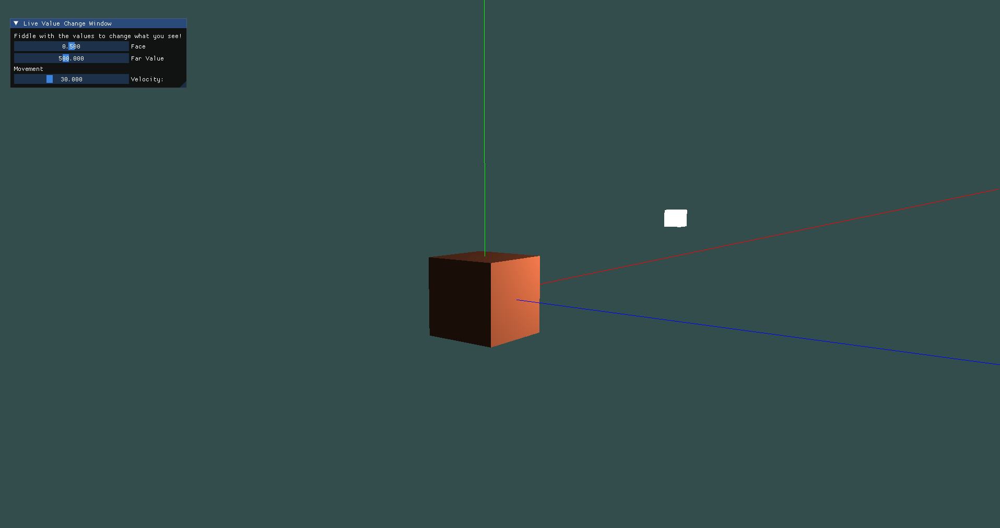

# Intro

I am working through [LearnOpenGL](https://learnopengl.com) to learn the fundamentals of graphics programming and to practice C++. Currently I have implemented a scene containing:

- a camera with free movement
- a cube with basic lighting (ambient, diffuse, specular)
- some GUI elements by integrating the [DearImGUI library](https://github.com/ocornut/imgui)
  - Can adjust camera movement speed and distance at which objects are rendered

# Build Trouble

Something important I learned early on with this project is that setting up a cross-platform build system can be quite challenging.
It is nowhere near perfect but at least it works for my solo-development purposes and I learned more about CMake.

An important piece of information I don't want to forget is the usage of the following command in my CMakeLists.txt:

    set(CMAKE_EXPORT_COMPILE_COMMANDS ON)

It creates a `compile_commands.json` file which in turn allows the **clangd language server** to work.

# Graphics Concepts:

## Shaders

Shaders are programs that are _not_ being executed by the CPU but by the **GPU**, the Graphics Card. The main difference between traditional programs and shaders is the way they are processed: While a "CPU-Program" is mostly processed in sequence using _threads_, shaders are processing huge amounts of data in _parallel_.
That is especially useful in graphics programming since the color of every pixel for every frame displayed on the screen must be calculated in time, and that is not really feasible for the CPU.
Additionally, GPUs were designed in a way that allows them to perform certain math operations alot faster than the CPU

There are a few different shader language to write these programs in. OpenGL uses **GLSL**, the OpenGL Shader Language, which resembles C.
Different Graphics Specifications have different shader languages, like DirectX's **HLSL** or the quite new **WGSL** for WebGPU.
