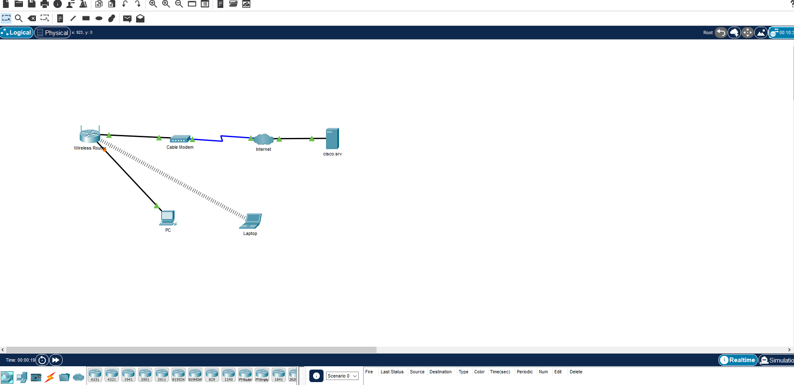

# Part 1 - The tools and basic concepts

\
This is the Cisco Packet Tracer: A simulator for learning about networking from two distinct points of view. First, you have the **Logical** View which allows you to view the network's _topology_ as a more abstract collection of nodes and their connections.
There also is the **Physical** View which, as the name implies, lets you interact with devices in a realistic manner: For example, you have to actually choose the right cable from the wall and connect it to the right port of the right device. I found this to be quite useful since I don't have direct access to many of the devices used in larger networks and the simulator allowed me to at least get to know these devices a bit.

## Learning about IPv4

IPv4 addresses are still the majority of IP addresses (but they will eventually be replaced by IPv6) and therefore the most well known version. Most people have probably at least seen an IPv4 address like `192.168.0.1`. In general, an IPv4 address consists of 4 numbers between 0 and 255 which are divided by a dot. Each of the four numbers represents an **octet**, 8 bits, and thus an IPv4 address is made up of _32 bits_.
This 32-bit Address Space allows for a maximum of about 4.3 billion addresses. That's one of the main reasons for the creation of IPv6, but more on that later.

### Public and Private

The IPv4 addresses are split into public and private addresses because of the depletion of v4 address space.
\
A private IP address can be used internally within any network and is used for communication _within_ this network. A public address on the other hand is unique and used for communication and identification on the **internet**.
When a device with a private IP address wants to communicate outside of its own network, the private IP needs to be _translated_ in a process called **Network Address Translation** (NAT).

### Different Types of Casts

| Type      | Description                                                                             |
| --------- | --------------------------------------------------------------------------------------- |
| Unicast   | The packet has only one specific destination                                            |
| Broadcast | Every device on the network will receive the packet (Destination IP: `255.255.255.255`) |
| Multicast | Only members of the specified _multicast group_ will process the packet                 |

## IPv6 Addresses

IPv6 is designed to be the successor to IPv4 and has a much larger _address space_ of 128 bits, making it unlikely for us to run out of them any time soon!
Both IP versions will have to coexist for quite some time as the world slowly transitions to IPv6. There are a few migration techniques:

- Dual Stack - Devices which run both IPv4 and 6 at the same time
- Tunneling - A method of transporting an IPv6 apcket over an IPv4 network via _encapsulation_
- Translation - **NAT64** allows IPv6 devices to communicate with IPv4 devices using a technqiue similar to NAT for v4

### Addressing Format

A IPv6 address is written as a string of **hexadecimal** values. Every four bits is represented by a single hex digit, for a total of 32 hexadecimal values.
For example: `0123:4567:89AB:CDEF:0A0A:1B1B:FFFF:0000`
